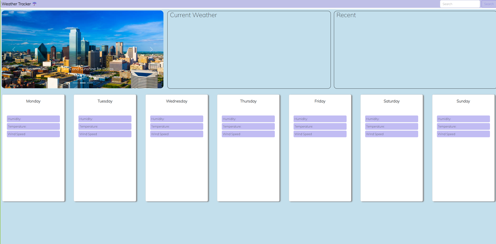

## User Story
This website was created to search for current weather and a 5-Day Forecast of the city the user picks. The website is built using a 5-Day Forecast API with fetch methods and jQuery. 
The user can look up a city name of their choosing in the search bar and be displayed the current weather and a 5 day forecast with an icon that displays the visual representation of the weather. 
Recent history of cities will also be displayed on the right side using local storage methods. 

## Link to Deployed Website
https://chadedwardsofficial.github.io/weather-tracker/

## Screenshot of Website

## Credit
All techniques used in this website are derived from SMU Coding Boot Camp, Online Internet Resources, Bootstrap and reddit.

## Update
Last updated: 10/16/2023